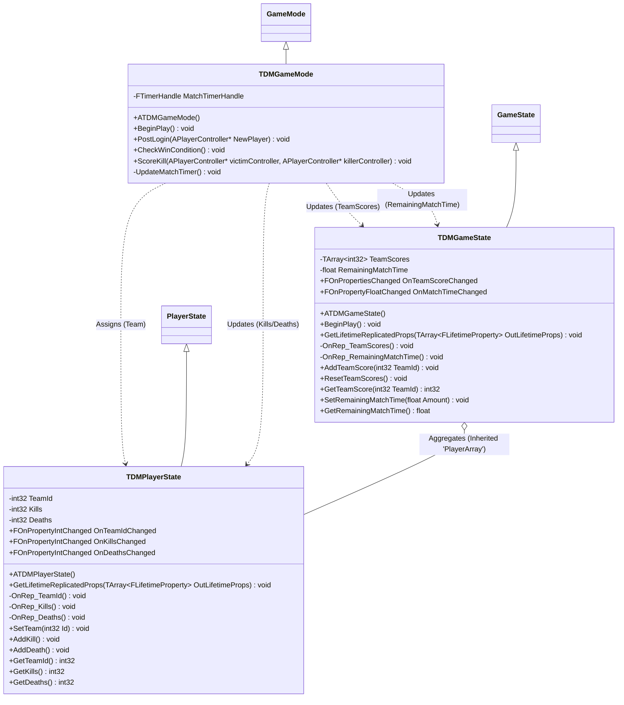

# Death match architecture
## Diagram

## Responsibilities
### GameMode
This is server only class that controls match flow and players connections. The only source of thruth that orchestrates everything for the match:
- Assigns team to the logined player
- Scores team points and personal player statistic(kills/deaths)
- Updates remaining match time using timer
- Controls match state -> ends it and decides winner

### GameState
Shared current state of the game, accessible from every point. Contains general information and is replicated for everyone:
- Contains replicated TeamScores (Updated by GameMode)
- Contains replicated RemainingMatchTime (Updated and controled by GameMode)
- Contains list of all PlayerStates (PlayerArray)

### PlayerState
Individual player information, shared and replicated on server and local player. Contains personal player statistic:
- Contains replicated Kills (Updated by GameMode)
- Contains replicated Deaths (Updated by GameMode)
- Contains replicated TeamId (Assigned by GameMode)
