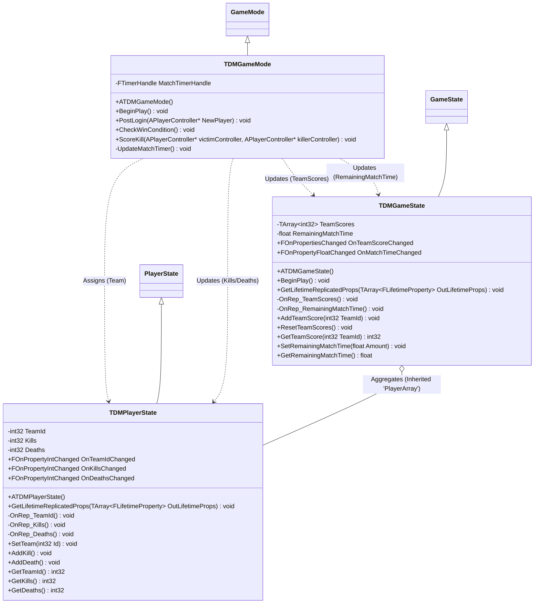

# Death match architecture
## Diagram

```mermaid
classDiagram
     class TDMGameMode {
        -FTimerHandle MatchTimerHandle
        +ATDMGameMode()
        +BeginPlay() void
        +PostLogin(APlayerController* NewPlayer) void
        +CheckWinCondition() void
        +ScoreKill(APlayerController* victimController, APlayerController* killerController) void
        -UpdateMatchTimer() void
    }

    class TDMGameState {
        -TArray~int32~ TeamScores
        -float RemainingMatchTime
        +FOnPropertiesChanged OnTeamScoreChanged
        +FOnPropertyFloatChanged OnMatchTimeChanged
        +ATDMGameState()
        +BeginPlay() void
        +GetLifetimeReplicatedProps(TArray~FLifetimeProperty~ OutLifetimeProps) void
        -OnRep_TeamScores() void
        -OnRep_RemainingMatchTime() void
        +AddTeamScore(int32 TeamId) void
        +ResetTeamScores() void
        +GetTeamScore(int32 TeamId) int32
        +SetRemainingMatchTime(float Amount) void
        +GetRemainingMatchTime() float
    }

    class TDMPlayerState {
        -int32 TeamId
        -int32 Kills
        -int32 Deaths
        +FOnPropertyIntChanged OnTeamIdChanged
        +FOnPropertyIntChanged OnKillsChanged
        +FOnPropertyIntChanged OnDeathsChanged
        +ATDMPlayerState()
        +GetLifetimeReplicatedProps(TArray~FLifetimeProperty~ OutLifetimeProps) void
        -OnRep_TeamId() void
        -OnRep_Kills() void
        -OnRep_Deaths() void
        +SetTeam(int32 Id) void
        +AddKill() void
        +AddDeath() void
        +GetTeamId() int32
        +GetKills() int32
        +GetDeaths() int32
    }

    GameMode <|-- TDMGameMode
    GameState <|-- TDMGameState
    PlayerState <|-- TDMPlayerState

    %% Interaction relationships (Dependencies)
    TDMGameMode ..> TDMGameState : Updates (RemainingMatchTime)
    TDMGameMode ..> TDMGameState : Updates (TeamScores)
    TDMGameMode ..> TDMPlayerState : Updates (Kills/Deaths)
    TDMGameMode ..> TDMPlayerState : Assigns (Team)

    TDMGameState o-- TDMPlayerState : Aggregates (Inherited 'PlayerArray')
```

## Responsibilities
### GameMode
This is server only class that controls match flow and players connections. The only source of thruth that orchestrates everything for the match:
- Assigns team to the logined player
- Scores team points and personal player statistic(kills/deaths)
- Updates remaining match time using timer
- Controls match state -> ends it and decides winner

### GameState
Shared current state of the game, accessible from every point. Contains general information and is replicated for everyone:
- Contains replicated TeamScores (Updated by GameMode)
- Contains replicated RemainingMatchTime (Updated and controled by GameMode)
- Contains list of all PlayerStates (PlayerArray)

### PlayerState
Individual player information, shared and replicated on server and local player. Contains personal player statistic:
- Contains replicated Kills (Updated by GameMode)
- Contains replicated Deaths (Updated by GameMode)
- Contains replicated TeamId (Assigned by GameMode)

---

# Online Subsystem & Backend Architecture

## Backend Choice & Justification
The project uses **Steam (`OnlineSubsystemSteam`)** alongside **SteamSockets (`SteamSocketsNetDriver`)** as the primary online multiplayer and session management backend.

### Why Steam?
1. **Seamless Integration & Zero Server Costs (`SteamDevAppId=480`)**:
   - Using Steam's Spacewar development AppID (`480`) allows testing full online multiplayer session discovery, lobby creation, and client travel over the internet without setting up dedicated master servers, custom authentication databases, or paying for external server hosting.
2. **NAT Traversal & P2P Packet Relay (`SteamSockets`)**:
   - Configured with `bUseSteamNetworking=true` and `bAllowP2PPacketRelay=true` in `DefaultEngine.ini`. it automatically overcoming strict NATs, firewalls, and router configurations without requiring players to port-forward.

---

## Authentication Method
The project utilizes **Platform-based Authentication (Steam Client & SteamID)**:
- **Automatic Client-Side Initialization (`bInitServerOnClient=true`)**: Authentication happens transparently when the game boots up while the Steam Desktop Client is running.
- **SteamID & Presence Verification**: `IOnlineSubsystem::Get()` communicates locally with the Steam daemon (`steam_api64.dll`). The player's active Steam credentials and unique 64-bit `SteamID` are automatically verified by Steam servers without requiring any manual sign-in, username/password entry, or third-party OAuth/JWT token handling.
- **Session Ownership & Presence**: When creating or joining a session, the host and client identity are securely bound to their authenticated Steam accounts, ensuring authenticated session joins and presence tracking across the Steam friends network.

---

## Known Limitations of Current Implementation

### 1. Steam AppID 480 (`Spacewar`) Sandbox Constraints
- **Shared Pool & Download Region Dependency**: Because AppID `480` is shared across thousands of Unreal Engine developers worldwide, session searches (`FindSessions`) can discover unrelated test lobbies. I enforced a custom match tag (`SessionSettings.Set("CUSTOM_MATCH_TAG", "P8TestBuild")`) to lower missed lobbys and make search quicker, but Steam's regional matchmaking filters helped too. Players located in distant geographical regions or with different download regions may fail to discover each other's lobbies.
- **Not Production-Ready**: AppID `480` is subject to strict rate limits and cannot be used for commercial distribution; a dedicated Steam AppID and store configuration are required for production release.

### 2. Listen Server Architecture & Host Migration
- **Host Advantage & Single Point of Failure**: When `CreateServerSession` succeeds, the host travels to `/Game/ThirdPerson/Lvl_ThirdPerson?listen`. The host runs both the authoritative server and a local client.
- **No Host Migration**: If the host quits, crashes, or disconnects, the session is destroyed (`DestroyServerSession`) and all connected clients (`ClientTravel`) are abruptly disconnected from the match.

### 3. Session Joining & Search Result Indexing
- **Stale Index Hazards**: `JoinServerSession(int32 SessionIndex)` joins a session based on the array index (`SessionSearch->SearchResults[SessionIndex]`) returned from the most recent `FindServerSessions()` query. If the session list changes between finding and joining, or if multiple clients attempt to join the exact same lobby slot concurrently, joining can fail without automatic retry or fallback.
- **Session Naming in UE5**: Because `FOnlineSessionSearchResult` in Unreal Engine 5 does not expose a local `SessionName`, joining uses `NAME_GameSession` as the local handle, which limits managing multiple concurrent local sessions.

### 4. Hardcoded Match Filtering & Capacity Handling
- **Static Match Tags**: The search and creation logic currently hardcode tag for custom match tagging. Testing different build versions or game modes simultaneously requires manual C++ changes or expanding the `InitSettings` parameter surface.
- **Full Lobby Handling**: While `NumPublicConnections` limits capacity, the UI/Subsystem does not currently implement a queue system or detailed error reporting if a player attempts to join a full lobby (`OnJoinSessionCompleted` logs error code but lacks graceful user-facing recovery prompts).

### 5. Steam Client Dependency
- **No Offline LAN / Direct IP Fallback in Subsystem**: If the Steam client is not running or offline when launching the game, `IOnlineSubsystem::Get()` will not return valid Steam session interfaces (`SessionInterface.IsValid()` returns false), preventing players from hosting or discovering lobbies via `USteamGameInstanceSubsystem`.
- **No LAN or same network**: If game tries to run from the same network it will be identified as LAN and players won't be able to play. This was done to ensure and test different network connection and gameplay.
