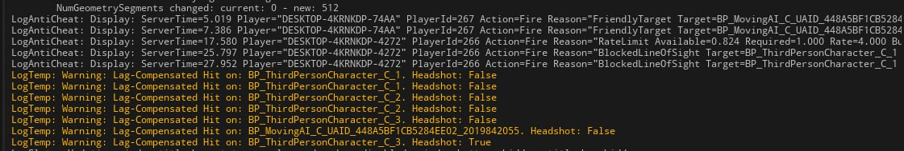

# Multiplayer Games Development: Security Audit (Week 10)

## Overview
This audit evaluates the server-side security hardening applied to a competitive multiplayer Unreal Engine project. The focus is on transitioning trust away from the client by validating movement, rate-limiting Remote Procedure Calls (RPCs), and aggressively verifying game state transitions on the server. Every rejected action is recorded via a dedicated structured logging category (`LogAntiCheat`) to allow for offline analysis and automated ban systems without flooding the standard warning logs.

Below is an analysis of five distinct abuse vectors mitigated during this hardening pass.

---

## Issue 1: RPC Rate Limiting (Weapon Fire Spam)
- **Vulnerability**: A hacked client can invoke `ServerFireWeapon` infinitely fast, completely bypassing weapon cooldowns, reload times, and fire rates.
- **Realistic Attack Scenario**: An attacker modifies their client to fire their weapon 100 times in a single frame. This instantly kills any target they look at.
- **Server-Side Mitigation**: An `URPCRateLimiterComponent` was added to track incoming requests per player state. When `ServerFireWeapon` is invoked, it consumes a budget via `ConsumeRPCBudget(FireAction, Settings->FireRateLimit)`. If the request exceeds the allowed burst threshold, it is dropped and logged with `RateLimitReason`.
- **Why Client-Side is Insufficient**: Client-side delays (e.g., timers in blueprints or UI) can be easily bypassed by injecting raw packets or manipulating game memory to skip the timer block. The server must enforce the rate independently.

## Issue 2: Impossible Movement Deltas (Speedhacks & Teleportation)
- **Vulnerability**: Character movement prediction relies on the client sending its desired position to the server. A malicious client could report its location significantly farther than its speed should allow.
- **Realistic Attack Scenario**: A speedhacker modifies their `MaxWalkSpeed` in memory or directly spoofs their transform to instantly teleport to the enemy spawn or capture a flag across the map.
- **Server-Side Mitigation**: In `UServerValidatedMovementComponent::ServerCheckClientError`, the server compares the distance moved against the theoretically maximum distance (`MaxWalkSpeed * (ElapsedServerTime + MovementBurstSeconds) * MovementSafetyMargin`). If the client exceeds this, the move is rejected and logged as `ImpossibleDelta`. Legitimate exceptions like `bJustTeleported` or `IsPlayingRootMotion` are explicitly permitted to avoid false positives.
- **Why Client-Side is Insufficient**: The physics engine and character movement logic run locally on the client to allow for smooth prediction. A hacked client can spoof any outcome. Only the server has a tamper-proof view of elapsed time to validate physical limits.

## Issue 3: Line of Sight Verification (Shooting through Geometry)
- **Vulnerability**: A client can request a hit on a target that should be occluded by a wall or terrain.
- **Realistic Attack Scenario**: An attacker combines an "aimbot" with a "wallhack" to lock onto enemies behind cover, instructing the server to register damage on players they physically cannot see.
- **Server-Side Mitigation**: Inside the lag-compensated shot validation (`AShotWeapon::ServerFireWeapon_Implementation`), after finding the best valid target based on rewound hitboxes, the server executes a strict `LineTraceSingleByChannel` check from the weapon muzzle to the target's torso. If a wall or obstacle blocks the trace, the damage is dropped and logged as `BlockedLineOfSight`.
- **Why Client-Side is Insufficient**: Clients can easily disable local collision checks or intercept the line trace function to return "unblocked" regardless of the map geometry. The server holds the authoritative collision mesh and must independently confirm the line of sight.

## Issue 4: Timestamp Spoofing (Severe Lag Manipulation)
- **Vulnerability**: Lag compensation requires the client to send the timestamp of when they took the shot so the server can rewind hitboxes. An attacker can manipulate this timestamp arbitrarily.
- **Realistic Attack Scenario**: An attacker sends timestamps from 15 seconds in the past to kill players who are safely behind cover but *were* in the open previously. Alternatively, they send future timestamps to pre-fire corners before they even arrive.
- **Server-Side Mitigation**: `AShotWeapon::ValidateFireRequest` strictly validates the provided `ClientTimeStamp` against `GameState->GetServerWorldTimeSeconds()`. It rejects requests that exceed the `Settings->MaxRewindSeconds` (e.g., logging `TimestampExpired`) or requests that are from the future beyond a minor tolerance (`TimestampFuture`).
- **Why Client-Side is Insufficient**: The client builds the RPC payload and can spoof any value for the time variable. Client-side checks can be patched out; the server must anchor the validation against its own internal clock.

## Issue 5: Friendly Fire & Invalid Target Claims
- **Vulnerability**: A client requests to deal damage or instantly kill a player that is on their own team, or requests an action that violates the game mode's ruleset.
- **Realistic Attack Scenario**: A griefer uses an exploit tool to manually trigger `KillValidatedTarget` or `ServerFireWeapon` on a teammate, bypassing the fact that the client-side UI prevents targeting friendlies.
- **Server-Side Mitigation**: In both `AShotWeapon::CalculateShot` and `AMP_game_structCharacter::KillValidatedTarget`, the server fetches the `ATDMPlayerState` of both the shooter and the victim. It checks `if (ShooterPS->GetTeamId() == TargetPS->GetTeamId())`. If true, the request is immediately dropped and logged as `FriendlyTarget`.
- **Why Client-Side is Insufficient**: Client-side scripts (like removing the crosshair on friendlies or disabling the shoot button) only govern the legitimate UI flow. They do not stop an injected hack from calling the server RPC directly. The server must enforce game rules contextually.

---

### Screenshot of Server Logs

